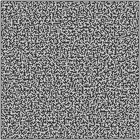
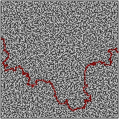

# MazeGenerator - using Kruskal's algorithm

## Build
```
git clone https://github.com/bpieszko/MazeGenerator.git
cd MazeGenerator/Kruskal
mkdir build
cd build
cmake ..
make
```

## Using
```
./MazeGenerator [height] [width]
```
example:
```
./MazeGenerator 50 50
```

## Sample output



## Author
Bartosz Pieszko

bartosz.pieszko@gmail.com
